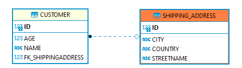
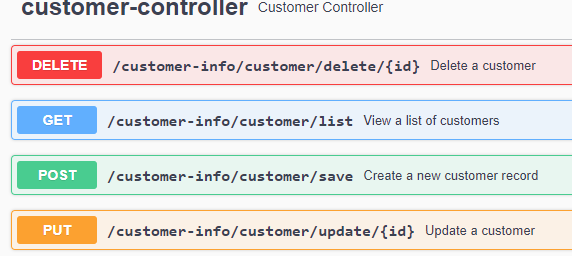

## spring-boot-hibernate-unidirectional-one-to-one-relationship-mapping

1- Implement hibernate unidirectional one-to-one relational mapping  
2- ER diagram :    

 

3- Start Spring Boot application with a specific profile such as "-Dspring.profiles.active=dev" .  
4- swagger-ui can be accessed from URL : http://localhost:8080/customer-info/swagger-ui/   

 

### Tech Stack
Java 11  
H2 Database Engine  
spring boot  
spring data jpa  
spring web  
hibernate  
logback  
maven  
junit  
springfox-swagger-ui  
datasource-proxy  
 

